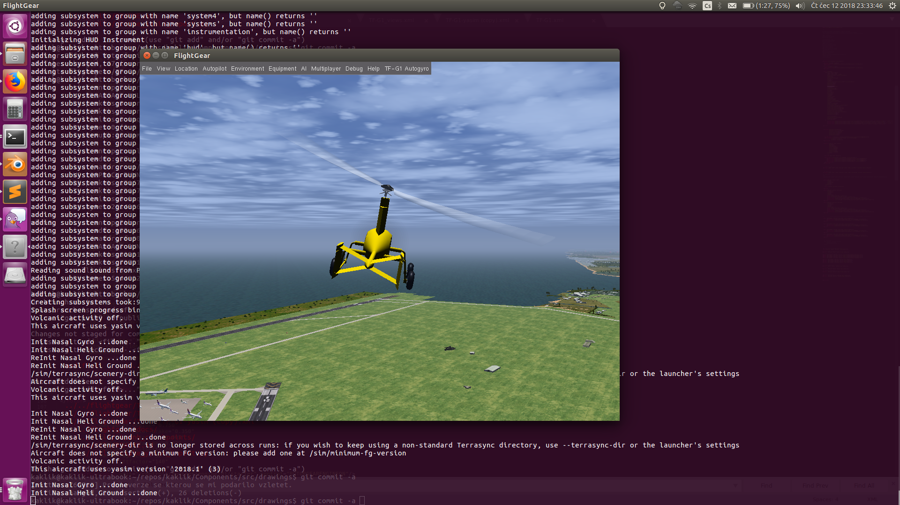

# TF-G1 UAV electric autogyro FlightGear simulator model

Model of TF-G1 autogyro for [FlightGear](https://home.flightgear.org/) simulator.  Its purpose is flight training of missions, modifications, and measurement campaigns in combination with [PX4 SITL](https://docs.px4.io/master/en/simulation/)

## Installation

### Linux
The TF-G1 folder contains all model data. Installation of the model itself should be performed by a copy of the TF-G1 folder into other simulator models. In case of Ubuntu Linux the folder is on the following path: `/usr/share/games/flightgear/Aircraft/`

It is also possible to use symlink from the cloned repository. But Flightgear does not use symlinks in the default configuration, therefore the symlinks need to be allowed by additional parameter `--allow-nasal-read`, as in the case of the following example:

    fgfs --aircraft=TF-G1 --disable-terrasync --disable-random-objects --disable-real-weather-fetch --allow-nasal-read=/usr/share/games/flightgear/Aircraft/TF-G1/Models/Liveries --timeofday=noon

### Windows

In the case of Microsoft Windows OS the model should be copied in the corresponding folder containing other aircrafts models.  

## Basic controls

The Help could be opened directly from the running FlightGear simulator by choose of Help from the menubar. Piloting the autogyro without a joystick is very difficult and it is not recommended to try. Some functions could be controlled by the keyboard: 

  * key "v" switch views
  * key "s" prerotate the rotor
  * key "B" upper-case B (including shift key), control parking brakes
  * Page-Up and Page-Down controls engine throttle
  * Tabulator key switch between mouse modes
  * Ctrl+w 	Place winch in front of aircraft, hook in, and start winch launch
  * "W"   Increase winch speed
  * "w" 	Decrease winch speed
  * Ctrl+"o" 	Find aircraft for aerotow and hook in
  * "o" Open both hooks (pulls the yellow lever) 

Every other input needs to be controlled proportionally, in some cases the computer mouse could be used.  By the better way is the use of [RC controller in joystick mode](https://opentx.gitbooks.io/manual-for-opentx-2-2/radio_joystick.html).

## Model limits

The current model implementation neglects some properties:

  * Real TF-G1 autogyro rotor has 1/3 of mass in load, which is mounted in 3/4 blade length. The current model implementation expects equally distributed mass along the blade length. As the result, the rotor energy of the simulated rotor is underestimated to real rotor energy.
  * The current model uses a combustion engine, which has a slower response compared to an electric engine used in real TF-G1
  * Propeller thrust is oriented straight parallel to the fuselage, the real thrust is inclined 10 degrees below the fuselage axis.

## TODO

  * Publish model in [FlightGear models list](http://wiki.flightgear.org/Table_of_models)
  * Include real textures
